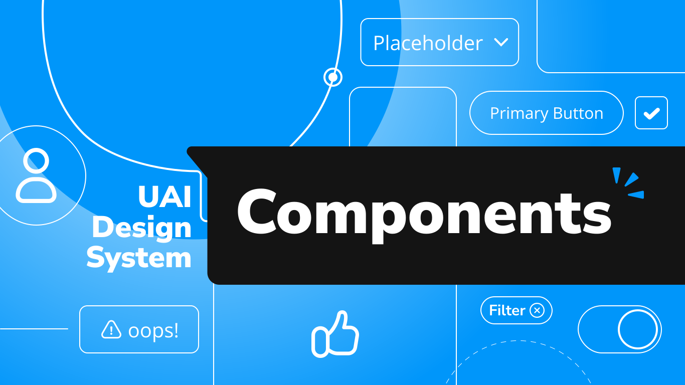

![Built With Stencil](https://img.shields.io/badge/-Built%20With%20Stencil-16161d.svg?logo=data%3Aimage%2Fsvg%2Bxml%3Bbase64%2CPD94bWwgdmVyc2lvbj0iMS4wIiBlbmNvZGluZz0idXRmLTgiPz4KPCEtLSBHZW5lcmF0b3I6IEFkb2JlIElsbHVzdHJhdG9yIDE5LjIuMSwgU1ZHIEV4cG9ydCBQbHVnLUluIC4gU1ZHIFZlcnNpb246IDYuMDAgQnVpbGQgMCkgIC0tPgo8c3ZnIHZlcnNpb249IjEuMSIgaWQ9IkxheWVyXzEiIHhtbG5zPSJodHRwOi8vd3d3LnczLm9yZy8yMDAwL3N2ZyIgeG1sbnM6eGxpbms9Imh0dHA6Ly93d3cudzMub3JnLzE5OTkveGxpbmsiIHg9IjBweCIgeT0iMHB4IgoJIHZpZXdCb3g9IjAgMCA1MTIgNTEyIiBzdHlsZT0iZW5hYmxlLWJhY2tncm91bmQ6bmV3IDAgMCA1MTIgNTEyOyIgeG1sOnNwYWNlPSJwcmVzZXJ2ZSI%2BCjxzdHlsZSB0eXBlPSJ0ZXh0L2NzcyI%2BCgkuc3Qwe2ZpbGw6I0ZGRkZGRjt9Cjwvc3R5bGU%2BCjxwYXRoIGNsYXNzPSJzdDAiIGQ9Ik00MjQuNywzNzMuOWMwLDM3LjYtNTUuMSw2OC42LTkyLjcsNjguNkgxODAuNGMtMzcuOSwwLTkyLjctMzAuNy05Mi43LTY4LjZ2LTMuNmgzMzYuOVYzNzMuOXoiLz4KPHBhdGggY2xhc3M9InN0MCIgZD0iTTQyNC43LDI5Mi4xSDE4MC40Yy0zNy42LDAtOTIuNy0zMS05Mi43LTY4LjZ2LTMuNkgzMzJjMzcuNiwwLDkyLjcsMzEsOTIuNyw2OC42VjI5Mi4xeiIvPgo8cGF0aCBjbGFzcz0ic3QwIiBkPSJNNDI0LjcsMTQxLjdIODcuN3YtMy42YzAtMzcuNiw1NC44LTY4LjYsOTIuNy02OC42SDMzMmMzNy45LDAsOTIuNywzMC43LDkyLjcsNjguNlYxNDEuN3oiLz4KPC9zdmc%2BCg%3D%3D&colorA=16161d&style=flat-square)


# BliP Design System

BliP Design System is a comprehensive component library built with Web Components using StencilJS, providing a consistent and scalable UI foundation for BliP applications. The design system includes reusable components, design tokens, and guidelines that follow BliP's design principles.

## 📦 Packages

This monorepo contains two main packages:

- **`blip-ds`** - Core web components built with StencilJS
- **`blip-ds-react`** - React wrapper components for seamless React integration

## 🎨 Design System

Components. Guides. Brands. It's all here, no riddles. [UAI is all yours](https://design.take.net/240287753/p/9953dc-take-blip-ds-elementar).



## 🚀 Features

- **Framework Agnostic**: Web Components work with any framework (React, Vue, Angular) or vanilla JavaScript
- **TypeScript Support**: Full TypeScript support with generated type definitions
- **Storybook Documentation**: Comprehensive component documentation and examples
- **React Integration**: Auto-generated React wrapper components for optimal React experience
- **Accessibility**: Components built with accessibility best practices
- **Testing**: Comprehensive unit and e2e test coverage

## 📋 Installation

### Core Web Components (`blip-ds`)

```bash
npm install blip-ds
```

### React Components (`blip-ds-react`)

```bash
npm install blip-ds-react
```

For detailed installation and usage instructions, visit the [Design Portal](https://design.take.net/240287753/p/216ef2-instalao/b/8176c4).

## 🛠️ Development

### Prerequisites

- Node.js 16+ 
- npm 7+

### Getting Started

```bash
# Clone the repository
git clone https://github.com/takenet/blip-ds.git
cd blip-ds

# Install dependencies
npm install

# Start development environment (Stencil + Storybook)
npm run dev

# Build the library
npm run build

# Build React wrapper components
npm run build:react

# Run tests
npm run test

# Start Storybook for component development
npm run storybook
```

### Project Structure

```
├── src/
│   ├── components/        # StencilJS web components
│   ├── assets/           # Static assets (images, SVGs)
│   ├── globals/          # Global styles and variables
│   ├── pages/            # Storybook documentation pages
│   ├── snippets/         # Reusable code examples
│   ├── templates/        # Full page layout templates
│   └── utils/            # Utility functions
├── blip-ds-react/        # React wrapper components
```

## 📖 Documentation

- **[Storybook](https://takenet.github.io/blip-ds/v2/?path=/docs/welcome--welcome)** - Interactive component documentation
- **[Design System](https://design.blip.ai/)** - Complete design guidelines and specifications
- **[GitHub](https://github.com/takenet/blip-ds)** - Source code and issue tracking

## 🏗️ Architecture

### StencilJS Core

The project uses [StencilJS](https://stenciljs.com/) as the core technology for building standards-compliant Web Components. StencilJS compiles components to highly optimized vanilla JavaScript that runs in any browser.

### React Integration

React wrapper components are automatically generated using `@stencil/react-output-target`, providing optimal React developer experience with proper TypeScript support and React-specific optimizations.

## 🧪 Testing

The project uses StencilJS's built-in testing utilities:

- **Unit Tests**: Component logic and functionality
- **E2E Tests**: Integration and user interaction scenarios

```bash
# Run all tests
npm run test

# Run tests for a specific component
npm run test -- -- <componentFolder>
```

## 📦 Versioning

`blip-ds` uses [Semantic Versioning](https://semver.org/).

### Release Branches

- **`main`** - Version 1.x (Stable)
- **`v2`** - Current v2 development (Release Candidate)

The v2 is currently in release candidate phase but it is already stable for production use. We recommend using the v2 branch for new projects.

## 🤝 Contributing

We welcome contributions! Please see our [Contributing Guide](CONTRIBUTING.md) for details on:

- Development workflow
- Code standards
- Testing requirements
- Pull request process

## 📄 License

`blip-ds` is under the [ISC license](https://opensource.org/licenses/ISC).