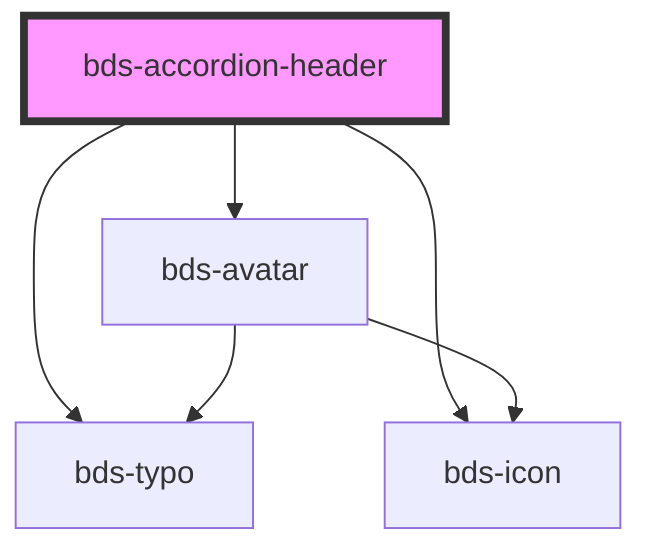

# bds-accordion-header

<!-- Auto Generated Below -->

## Properties

| Property         | Attribute         | Description                                             | Type     | Default |
| ---------------- | ----------------- | ------------------------------------------------------- | -------- | ------- |
| `accordionTitle` | `accordion-title` | Accordion Title. Used to add title in header accordion. | `string` | `null`  |
| `avatarName`     | `avatar-name`     | Avatar Name. Used to add avatar in header accordion.    | `string` | `null`  |
| `avatarThumb`    | `avatar-thumb`    | Avatar Thumb. Used to add avatar in header accordion.   | `string` | `null`  |
| `icon`           | `icon`            | Icon. Used to add icon in header accordion.             | `string` | `null`  |

## Methods

### `close() => Promise<void>`

#### Returns

Type: `Promise<void>`

### `toggle() => Promise<void>`

#### Returns

Type: `Promise<void>`

## Dependencies

### Depends on

- [bds-avatar](../avatar)
- [bds-icon](../icon)
- [bds-typo](../typo)

### Graph

----------------------------------------------

*Built with [StencilJS](https://stenciljs.com/)*
