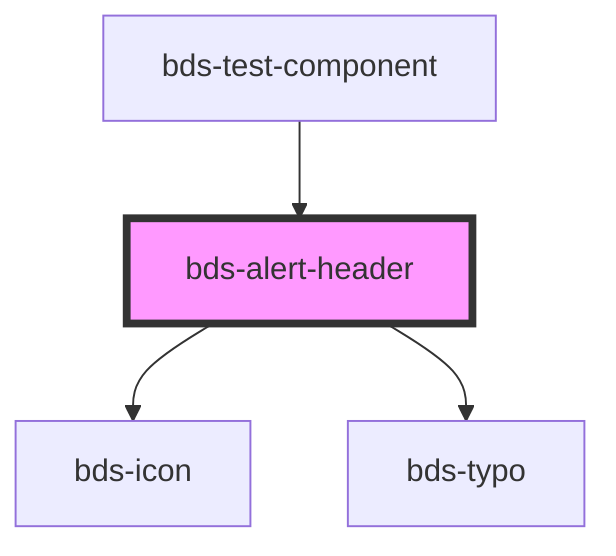

# alert-header

<!-- Auto Generated Below -->

## Properties

| Property  | Attribute | Description                                                                                    | Type                                           | Default    |
| --------- | --------- | ---------------------------------------------------------------------------------------------- | ---------------------------------------------- | ---------- |
| `icon`    | `icon`    | used for add icon the header. Uses the bds-icon component.                                     | `string`                                       | `null`     |
| `variant` | `variant` | Variant. Entered as one of the variant. Can be one of: 'system', 'error', 'warning', 'delete'; | `"delete" \| "error" \| "system" \| "warning"` | `'system'` |

## Dependencies

### Used by

 - [bds-test-component](../../test-component)

### Depends on

- [bds-icon](../../icon)
- [bds-typo](../../typo)

### Graph

----------------------------------------------

*Built with [StencilJS](https://stenciljs.com/)*
