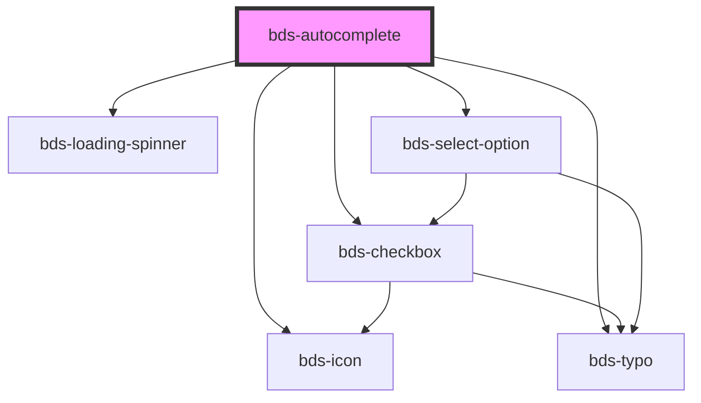

# bds-autocomplete

<!-- Auto Generated Below -->

## Properties

| Property           | Attribute             | Description                                                                                                                                                                                                                                                                                   | Type                             | Default     |
| ------------------ | --------------------- | --------------------------------------------------------------------------------------------------------------------------------------------------------------------------------------------------------------------------------------------------------------------------------------------- | -------------------------------- | ----------- |
| `clearIconOnFocus` | `clear-icon-on-focus` | If true, the X icon will appear only when component is focused.                                                                                                                                                                                                                               | `boolean`                        | `false`     |
| `danger`           | `danger`              | Add state danger on input, use for use feedback.                                                                                                                                                                                                                                              | `boolean`                        | `false`     |
| `dataTest`         | `data-test`           | Data test is the prop to specifically test the component action object.                                                                                                                                                                                                                       | `string`                         | `null`      |
| `disabled`         | `disabled`            | Disabled input.                                                                                                                                                                                                                                                                               | `boolean`                        | `false`     |
| `errorMessage`     | `error-message`       | Indicated to pass an feeback to user.                                                                                                                                                                                                                                                         | `string`                         | `''`        |
| `helperMessage`    | `helper-message`      | Indicated to pass a help the user in complex filling.                                                                                                                                                                                                                                         | `string`                         | `''`        |
| `icon`             | `icon`                | used for add icon in input left. Uses the bds-icon component.                                                                                                                                                                                                                                 | `string`                         | `''`        |
| `label`            | `label`               | label in input, with he the input size increases.                                                                                                                                                                                                                                             | `string`                         | `''`        |
| `loading`          | `loading`             | Is Loading, is the prop to enable that the component is loading.                                                                                                                                                                                                                              | `boolean`                        | `false`     |
| `options`          | `options`             | The options of the select Should be passed this way: options='[{"value": "Cat", "label": "Meow"}, {"value": "Dog", "label": "Woof"}]' Options can also be passed as child by using bds-select-option component, but passing as a child you may have some compatibility problems with Angular. | `AutocompleteOption[] \| string` | `undefined` |
| `optionsPosition`  | `options-position`    | Set the placement of the options menu. Can be 'bottom' or 'top'.                                                                                                                                                                                                                              | `"auto" \| "bottom" \| "top"`    | `'auto'`    |
| `placeholder`      | `placeholder`         | Placeholder for native input element.                                                                                                                                                                                                                                                         | `string`                         | `''`        |
| `searchOnlyTitle`  | `search-only-title`   | Search only the title property                                                                                                                                                                                                                                                                | `boolean`                        | `true`      |
| `selected`         | --                    | the item selected.                                                                                                                                                                                                                                                                            | `HTMLBdsSelectOptionElement`     | `undefined` |
| `selectedAll`      | `selected-all`        | Selection Title, Prop to enable title to select.                                                                                                                                                                                                                                              | `boolean`                        | `true`      |
| `selectionTitle`   | `selection-title`     | Selection Title, Prop to enable title to select.                                                                                                                                                                                                                                              | `string`                         | `''`        |
| `selectionType`    | `selection-type`      | Multiselect, Prop to enable multi selections.                                                                                                                                                                                                                                                 | `"multiple" \| "single"`         | `'single'`  |
| `success`          | `success`             | Add state success on input, use for use feedback.                                                                                                                                                                                                                                             | `boolean`                        | `false`     |
| `successMessage`   | `success-message`     | Indicated to pass an feeback to user.                                                                                                                                                                                                                                                         | `string`                         | `''`        |
| `value`            | `value`               | the value of the select.                                                                                                                                                                                                                                                                      | `string`                         | `undefined` |

## Events

| Event                    | Description                                  | Type                                                      |
| ------------------------ | -------------------------------------------- | --------------------------------------------------------- |
| `bdsBlur`                | Emitted when the select loses focus.         | `CustomEvent<void>`                                       |
| `bdsCancel`              | Emitted when the selection is cancelled.     | `CustomEvent<AutocompleteChangeEventDetail>`              |
| `bdsChange`              | Emitted when the value has changed.          | `CustomEvent<AutocompleteChangeEventDetail>`              |
| `bdsFocus`               | Emitted when the select loses focus.         | `CustomEvent<void>`                                       |
| `bdsInput`               | Emitted when the input has changed.          | `CustomEvent<KeyboardEvent>`                              |
| `bdsMultiselectedChange` | Emitted when the selected value has changed. | `CustomEvent<AutocompleteMultiSelectedChangeEventDetail>` |
| `bdsSelectedChange`      | Emitted when the selected value has changed. | `CustomEvent<AutocompleteSelectedChangeEventDetail>`      |

## Methods

### `cleanMultipleSelection() => Promise<void>`

#### Returns

Type: `Promise<void>`

## Shadow Parts

| Part               | Description |
| ------------------ | ----------- |
| `"input__message"` |             |

## Dependencies

### Depends on

- [bds-icon](../icon)
- [bds-typo](../typo)
- [bds-loading-spinner](../loading-spinner)
- [bds-checkbox](../checkbox)
- [bds-select-option](../select-option)

### Graph

----------------------------------------------

*Built with [StencilJS](https://stenciljs.com/)*
