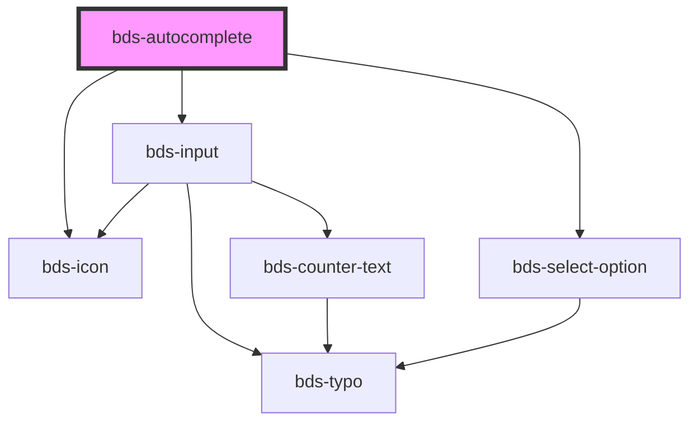

# bds-autocomplete

<!-- Auto Generated Below -->

## Properties

| Property          | Attribute           | Description                                                                                                                                                                                                                                                                                   | Type                             | Default     |
| ----------------- | ------------------- | --------------------------------------------------------------------------------------------------------------------------------------------------------------------------------------------------------------------------------------------------------------------------------------------- | -------------------------------- | ----------- |
| `danger`          | `danger`            | Add state danger on input, use for use feedback.                                                                                                                                                                                                                                              | `boolean`                        | `false`     |
| `disabled`        | `disabled`          | Disabled input.                                                                                                                                                                                                                                                                               | `boolean`                        | `false`     |
| `icon`            | `icon`              | used for add icon in input left. Uses the bds-icon component.                                                                                                                                                                                                                                 | `string`                         | `''`        |
| `label`           | `label`             | label in input, with he the input size increases.                                                                                                                                                                                                                                             | `string`                         | `''`        |
| `options`         | `options`           | The options of the select Should be passed this way: options='[{"value": "Cat", "label": "Meow"}, {"value": "Dog", "label": "Woof"}]' Options can also be passed as child by using bds-select-option component, but passing as a child you may have some compatibility problems with Angular. | `AutocompleteOption[] \| string` | `undefined` |
| `optionsPosition` | `options-position`  | Set the placement of the options menu. Can be 'bottom' or 'top'.                                                                                                                                                                                                                              | `"bottom" \| "top"`              | `'bottom'`  |
| `placeholder`     | `placeholder`       | Placeholder for native input element.                                                                                                                                                                                                                                                         | `string`                         | `''`        |
| `searchOnlyTitle` | `search-only-title` | Search only the title property                                                                                                                                                                                                                                                                | `boolean`                        | `true`      |
| `selected`        | --                  | the item selected.                                                                                                                                                                                                                                                                            | `HTMLBdsSelectOptionElement`     | `undefined` |
| `value`           | `value`             | the value of the select.                                                                                                                                                                                                                                                                      | `string`                         | `undefined` |

## Events

| Event               | Description                                  | Type                                                 |
| ------------------- | -------------------------------------------- | ---------------------------------------------------- |
| `bdsBlur`           | Emitted when the select loses focus.         | `CustomEvent<void>`                                  |
| `bdsCancel`         | Emitted when the selection is cancelled.     | `CustomEvent<void>`                                  |
| `bdsChange`         | Emitted when the value has changed.          | `CustomEvent<AutocompleteChangeEventDetail>`         |
| `bdsFocus`          | Emitted when the select loses focus.         | `CustomEvent<void>`                                  |
| `bdsSelectedChange` | Emitted when the selected value has changed. | `CustomEvent<AutocompleteSelectedChangeEventDetail>` |

## Dependencies

### Depends on

- [bds-input](../input)
- [bds-icon](../icon)
- [bds-select-option](../select-option)

### Graph

----------------------------------------------

*Built with [StencilJS](https://stenciljs.com/)*
