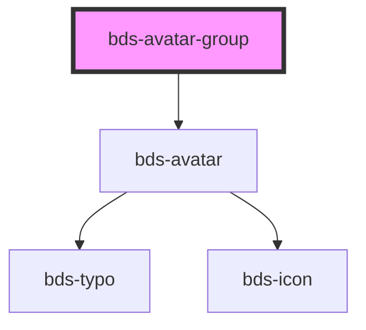

# avatar-group

<!-- Auto Generated Below -->

## Properties

| Property | Attribute | Description                                                                                                                                                                                                                                                                                                                                                                                                                                                                                                                                                                                                                                                                                                                                                                                                                                                                                                                                                                                                                                                                                                                                                                                                                                                                                                                                                             | Type                                     | Default      |
| -------- | --------- | ----------------------------------------------------------------------------------------------------------------------------------------------------------------------------------------------------------------------------------------------------------------------------------------------------------------------------------------------------------------------------------------------------------------------------------------------------------------------------------------------------------------------------------------------------------------------------------------------------------------------------------------------------------------------------------------------------------------------------------------------------------------------------------------------------------------------------------------------------------------------------------------------------------------------------------------------------------------------------------------------------------------------------------------------------------------------------------------------------------------------------------------------------------------------------------------------------------------------------------------------------------------------------------------------------------------------------------------------------------------------- | ---------------------------------------- | ------------ |
| `size`   | `size`    | Size. Entered as one of the size. Can be one of: 'extra-small', 'small', 'standard', 'large', 'extra-large'.                                                                                                                                                                                                                                                                                                                                                                                                                                                                                                                                                                                                                                                                                                                                                                                                                                                                                                                                                                                                                                                                                                                                                                                                                                                            | `"extra-small" \| "small" \| "standard"` | `'standard'` |
| `users`  | `users`   | The users of the select Should be passed this way: users='[   {"id": "1", "name": "Michael Scott", "thumbnail": "https://blip.university/wp-content/uploads/bb-platform-previews/b9014e776e469ca6dae702955bf32e95/92152d262175be2384854d0b286e84df"},   {"id": "2", "name": "Dwight Schrute", "thumbnail": "https://blip.university/wp-content/uploads/bb-platform-previews/b9014e776e469ca6dae702955bf32e95/15d6d90235aabcee62fbc26c3f1a31b2"},   {"id": "3", "name": "Jim Halpert", "thumbnail": "https://blip.university/wp-content/uploads/bb-platform-previews/b9014e776e469ca6dae702955bf32e95/ca23c3552d5e36d447d6f9eef5d9d5bc"},   {"id": "4", "name": "Pam Beesly", "thumbnail": "https://blip.university/wp-content/uploads/bb-platform-previews/b9014e776e469ca6dae702955bf32e95/a6adb1435e4267d983e5fd246302003a"},   {"id": "5", "name": "Ryan Howard", "thumbnail": "https://blip.university/wp-content/uploads/bb-platform-previews/b9014e776e469ca6dae702955bf32e95/ae4cfce3c2e6db162d1f7f137062dcd2"},   {"id": "6", "name": "Andy Bernard", "thumbnail": "https://blip.university/wp-content/uploads/bb-platform-previews/b9014e776e469ca6dae702955bf32e95/25617c2e17f7bcbe847c7e4730ef5b03"} ]' users can also be passed as child by using bds-avatar-group component, but passing as a child you may have some compatibility problems with Angular. | `AvatarDataList[] \| string`             | `undefined`  |

## Dependencies

### Depends on

- [bds-avatar](../avatar)

### Graph

----------------------------------------------

*Built with [StencilJS](https://stenciljs.com/)*
