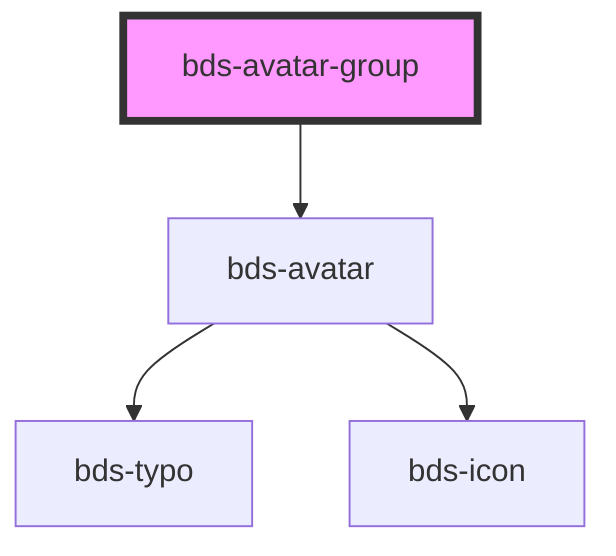

# avatar-group

<!-- Auto Generated Below -->

## Properties

| Property | Attribute | Description                                                                                                                                                                                                                                                                                                                                                                                                                                                                                                                                                       | Type                                     | Default      |
| -------- | --------- | ----------------------------------------------------------------------------------------------------------------------------------------------------------------------------------------------------------------------------------------------------------------------------------------------------------------------------------------------------------------------------------------------------------------------------------------------------------------------------------------------------------------------------------------------------------------- | ---------------------------------------- | ------------ |
| `size`   | `size`    | Size. Entered as one of the size. Can be one of: 'extra-small', 'small', 'standard', 'large', 'extra-large'.                                                                                                                                                                                                                                                                                                                                                                                                                                                      | `"extra-small" \| "small" \| "standard"` | `'standard'` |
| `users`  | `users`   | The users of the select Should be passed this way: users='[   {"id": "1", "name": "Michael Scott", "thumbnail": ""},   {"id": "2", "name": "Dwight Schrute", "thumbnail": ""},   {"id": "3", "name": "Jim Halpert", "thumbnail": ""},   {"id": "4", "name": "Pam Beesly", "thumbnail": ""},   {"id": "5", "name": "Ryan Howard", "thumbnail": ""},   {"id": "6", "name": "Andy Bernard", "thumbnail": ""} ]' users can also be passed as child by using bds-avatar-group component, but passing as a child you may have some compatibility problems with Angular. | `AvatarDataList[] \| string`             | `undefined`  |

## Dependencies

### Depends on

- [bds-avatar](../avatar)

### Graph

----------------------------------------------

*Built with [StencilJS](https://stenciljs.com/)*
