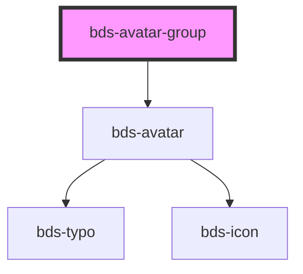

# avatar-group

<!-- Auto Generated Below -->

## Properties

| Property   | Attribute   | Description                                                                                                                                                                                                                                                                                                                                                                                                                                                                                                                                                                                                                                                                                                                                                                                                                                                       | Type                                     | Default      |
| ---------- | ----------- | ----------------------------------------------------------------------------------------------------------------------------------------------------------------------------------------------------------------------------------------------------------------------------------------------------------------------------------------------------------------------------------------------------------------------------------------------------------------------------------------------------------------------------------------------------------------------------------------------------------------------------------------------------------------------------------------------------------------------------------------------------------------------------------------------------------------------------------------------------------------- | ---------------------------------------- | ------------ |
| `canClick` | `can-click` |                                                                                                                                                                                                                                                                                                                                                                                                                                                                                                                                                                                                                                                                                                                                                                                                                                                                   | `boolean`                                | `undefined`  |
| `size`     | `size`      | Size. Entered as one of the size. Can be one of: 'extra-small', 'small', 'standard', 'large', 'extra-large'.                                                                                                                                                                                                                                                                                                                                                                                                                                                                                                                                                                                                                                                                                                                                                      | `"extra-small" \| "small" \| "standard"` | `'standard'` |
| `users`    | `users`     | The users of the select Should be passed this way: users='[   {"id": "1", "name": "Michael Scott", "thumbnail": "https://gcdn.pbrd.co/images/9Kt8iMvR10Lf.jpg?o=1"},   {"id": "2", "name": "Dwight Schrute", "thumbnail": "https://gcdn.pbrd.co/images/XAlbTPDwjZ2d.jpg?o=1"},   {"id": "3", "name": "Jim Halpert", "thumbnail": "https://gcdn.pbrd.co/images/tK0Ygb0KAHUm.jpg?o=1"},   {"id": "4", "name": "Pam Beesly", "thumbnail": "https://gcdn.pbrd.co/images/8NZSnCGfB9BD.jpg?o=1"},   {"id": "5", "name": "Ryan Howard", "thumbnail": "https://gcdn.pbrd.co/images/6wwIWI1EzzVq.jpg?o=1"},   {"id": "6", "name": "Andy Bernard", "thumbnail": "https://gcdn.pbrd.co/images/5dPYFWixftY4.jpg?o=1"} ]' users can also be passed as child by using bds-avatar-group component, but passing as a child you may have some compatibility problems with Angular. | `AvatarDataList[] \| string`             | `undefined`  |

## Events

| Event                 | Description | Type                        |
| --------------------- | ----------- | --------------------------- |
| `bdsClickAvatarGroup` |             | `CustomEvent<PointerEvent>` |

## Dependencies

### Depends on

- [bds-avatar](../avatar)

### Graph

----------------------------------------------

*Built with [StencilJS](https://stenciljs.com/)*
