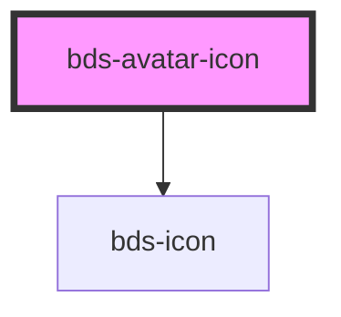

# bds-avatar

<!-- Auto Generated Below -->

## Properties

| Property   | Attribute   | Description                           | Type                                                                                                                                                                                                                                                                                                                                                                                                                                                                                                                                                                                                                                                                                                                                                                                | Default     |
| ---------- | ----------- | ------------------------------------- | ----------------------------------------------------------------------------------------------------------------------------------------------------------------------------------------------------------------------------------------------------------------------------------------------------------------------------------------------------------------------------------------------------------------------------------------------------------------------------------------------------------------------------------------------------------------------------------------------------------------------------------------------------------------------------------------------------------------------------------------------------------------------------------- | ----------- |
| `color`    | `color`     | The color of the icon.                | `"system" \| "error" \| "warning" \| "delete" \| "brand" \| "success" \| "focus" \| "info" \| "positive" \| "negative" \| "primary" \| "secondary" \| "surface-0" \| "surface-1" \| "surface-2" \| "surface-3" \| "surface-4" \| "surface-positive" \| "surface-negative" \| "surface-primary" \| "content-default" \| "content-disable" \| "content-ghost" \| "content-bright" \| "content-din" \| "extended-blue" \| "extended-blue-bright" \| "extended-ocean" \| "extended-ocean-bright" \| "extended-green" \| "extended-green-bright" \| "extended-yellow" \| "extended-yellow-bright" \| "extended-orange" \| "extended-orange-bright" \| "extended-red" \| "extended-red-bright" \| "extended-pink" \| "extended-pink-bright" \| "extended-gray" \| "extended-gray-bright"` | `null`      |
| `iconName` | `icon-name` | The name of the icon to be displayed. | `string`                                                                                                                                                                                                                                                                                                                                                                                                                                                                                                                                                                                                                                                                                                                                                                            | `undefined` |
| `size`     | `size`      | The size of the icon.                 | `"brand" \| "large" \| "medium" \| "small" \| "x-large" \| "x-small" \| "xx-large" \| "xx-small" \| "xxx-large" \| "xxx-small"`                                                                                                                                                                                                                                                                                                                                                                                                                                                                                                                                                                                                                                                     | `'medium'`  |
| `theme`    | `theme`     | The theme of the icon.                | `"outline" \| "solid"`                                                                                                                                                                                                                                                                                                                                                                                                                                                                                                                                                                                                                                                                                                                                                              | `'outline'` |
| `type`     | `type`      | The type of the icon.                 | `"emoji" \| "icon" \| "logo"`                                                                                                                                                                                                                                                                                                                                                                                                                                                                                                                                                                                                                                                                                                                                                       | `'icon'`    |

## Methods

### `setColor(color: BgColor) => Promise<void>`

Method to update the icon color.

#### Returns

Type: `Promise<void>`

### `setIconName(name: string) => Promise<void>`

Method to update the icon name.

#### Returns

Type: `Promise<void>`

### `setSize(size: IconSize) => Promise<void>`

Method to update the icon size.

#### Returns

Type: `Promise<void>`

### `setTheme(theme: IconTheme) => Promise<void>`

Method to update the icon theme.

#### Returns

Type: `Promise<void>`

## Dependencies

### Depends on

- [bds-icon](../icon)

### Graph

----------------------------------------------

*Built with [StencilJS](https://stenciljs.com/)*
