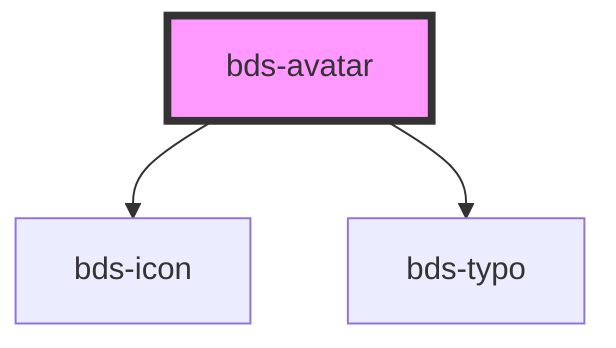

# bds-avatar

<!-- Auto Generated Below -->

## Properties

| Property    | Attribute   | Description                                                                                                  | Type                                                                 | Default      |
| ----------- | ----------- | ------------------------------------------------------------------------------------------------------------ | -------------------------------------------------------------------- | ------------ |
| `button`    | `button`    | Button. Serve to enable button function on avatar.                                                           | `boolean`                                                            | `false`      |
| `name`      | `name`      | Name. Inserted for highlighted osuary name. Enter the full name.                                             | `string`                                                             | `null`       |
| `size`      | `size`      | Size. Entered as one of the size. Can be one of: 'extra-small', 'small', 'standard', 'large', 'extra-large'. | `"extra-large" \| "extra-small" \| "large" \| "small" \| "standard"` | `'standard'` |
| `thumbnail` | `thumbnail` | Thumbnail. Inserted to highlight user image. Url field.                                                      | `string`                                                             | `null`       |

## Dependencies

### Depends on

- [bds-icon](../icon)
- [bds-typo](../typo)

### Graph

----------------------------------------------

*Built with [StencilJS](https://stenciljs.com/)*
