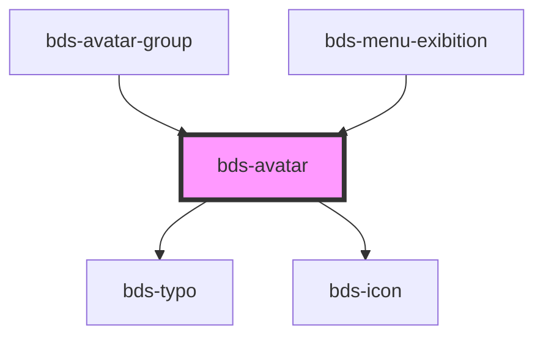

# bds-avatar

<!-- Auto Generated Below -->

## Properties

| Property    | Attribute   | Description                                                                                                  | Type                                                                            | Default      |
| ----------- | ----------- | ------------------------------------------------------------------------------------------------------------ | ------------------------------------------------------------------------------- | ------------ |
| `ellipsis`  | `ellipsis`  | Ellipses, serves to indicate the user number in the listing.                                                 | `number`                                                                        | `null`       |
| `name`      | `name`      | Name, Inserted for highlighted osuary name. Enter the full name.                                             | `string`                                                                        | `null`       |
| `size`      | `size`      | Size, Entered as one of the size. Can be one of: 'extra-small', 'small', 'standard', 'large', 'extra-large'. | `"extra-large" \| "extra-small" \| "large" \| "micro" \| "small" \| "standard"` | `'standard'` |
| `thumbnail` | `thumbnail` | Thumbnail, Inserted to highlight user image. Url field.                                                      | `string`                                                                        | `null`       |
| `upload`    | `upload`    | Upload, Serve to enable upload function on avatar.                                                           | `boolean`                                                                       | `false`      |

## Dependencies

### Used by

 - [bds-avatar-group](../avatar-group)
 - [bds-menu-exibition](../menu/menu-exibition)

### Depends on

- [bds-typo](../typo)
- [bds-icon](../icon)

### Graph

----------------------------------------------

*Built with [StencilJS](https://stenciljs.com/)*
