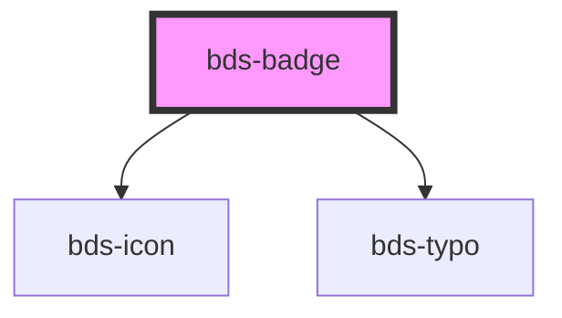

# bds-badge

<!-- Auto Generated Below -->

## Properties

| Property    | Attribute   | Description                                                                                                 | Type                                                                    | Default    |
| ----------- | ----------- | ----------------------------------------------------------------------------------------------------------- | ----------------------------------------------------------------------- | ---------- |
| `animation` | `animation` | If true, actived the pulse animation.                                                                       | `boolean`                                                               | `false`    |
| `color`     | `color`     | Set the color of the component.                                                                             | `string`                                                                | `'system'` |
| `icon`      | `icon`      | Set witch icon will be render inside the component.                                                         | `string`                                                                | `null`     |
| `shape`     | `shape`     | Set the shape of the component.                                                                             | `"circle" \| "polygon" \| "square" \| "triangle" \| "triangle-reverse"` | `'circle'` |
| `text`      | `text`      | Set the text in shape circle. Is just alow numbers, but if the number pass 999 a symbol '+' will be render. | `number`                                                                | `null`     |

## Dependencies

### Depends on

- [bds-icon](../icon)
- [bds-typo](../typo)

### Graph

----------------------------------------------

*Built with [StencilJS](https://stenciljs.com/)*
