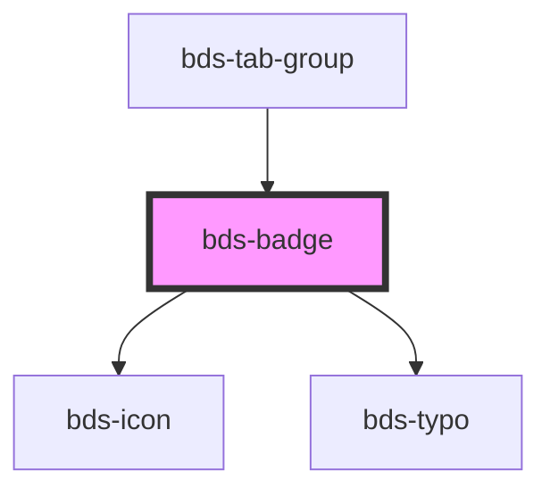

# bds-badge

<!-- Auto Generated Below -->

## Properties

| Property    | Attribute    | Description                                                                                                 | Type                                                                    | Default     |
| ----------- | ------------ | ----------------------------------------------------------------------------------------------------------- | ----------------------------------------------------------------------- | ----------- |
| `animation` | `animation`  | If true, activates the pulse animation. This prop only works if the shape prop is set to 'circle'.          | `boolean`                                                               | `false`     |
| `color`     | `color`      | Set the color of the component.                                                                             | `string`                                                                | `'system'`  |
| `dataTest`  | `data-test`  | Data test is the prop to specifically test the component action object.                                     | `string`                                                                | `null`      |
| `icon`      | `icon`       | Set witch icon will be render inside the component.                                                         | `string`                                                                | `null`      |
| `iconTheme` | `icon-theme` | Set the theme of the icon.                                                                                  | `"outline" \| "solid"`                                                  | `'outline'` |
| `number`    | `number`     | Set the text in shape circle. Is just alow numbers, but if the number pass 999 a symbol '+' will be render. | `number`                                                                | `undefined` |
| `shape`     | `shape`      | Set the shape of the component.                                                                             | `"circle" \| "polygon" \| "square" \| "triangle" \| "triangle-reverse"` | `'circle'`  |

## Methods

### `setAnimation(newAnimation: boolean) => Promise<void>`

#### Returns

Type: `Promise<void>`

### `setColor(newColor: Color) => Promise<void>`

#### Returns

Type: `Promise<void>`

### `setIcon(newIcon: string) => Promise<void>`

#### Returns

Type: `Promise<void>`

### `setIconTheme(newIconTheme: IconTheme) => Promise<void>`

#### Returns

Type: `Promise<void>`

### `setNumber(newNumber: number) => Promise<void>`

#### Returns

Type: `Promise<void>`

### `setShape(newShape: Shape) => Promise<void>`

#### Returns

Type: `Promise<void>`

### `setType(newType: Type) => Promise<void>`

#### Returns

Type: `Promise<void>`

## Dependencies

### Used by

 - [bds-tab-group](../tabs)

### Depends on

- [bds-icon](../icon)
- [bds-typo](../typo)

### Graph

----------------------------------------------

*Built with [StencilJS](https://stenciljs.com/)*
