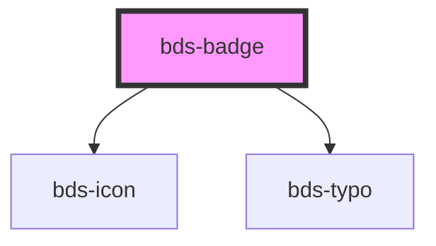

# bds-badge

<!-- Auto Generated Below -->

## Properties

| Property | Attribute | Description | Type                                                                    | Default     |
| -------- | --------- | ----------- | ----------------------------------------------------------------------- | ----------- |
| `color`  | `color`   |             | `string`                                                                | `'system'`  |
| `icon`   | `icon`    |             | `string`                                                                | `undefined` |
| `shape`  | `shape`   |             | `"circle" \| "polygon" \| "square" \| "triangle" \| "triangle-reverse"` | `undefined` |
| `text`   | `text`    |             | `string`                                                                | `undefined` |
| `type`   | `type`    |             | `"icon" \| "status" \| "text"`                                          | `undefined` |

## Dependencies

### Depends on

- [bds-icon](../icon)
- [bds-typo](../typo)

### Graph

----------------------------------------------

*Built with [StencilJS](https://stenciljs.com/)*
