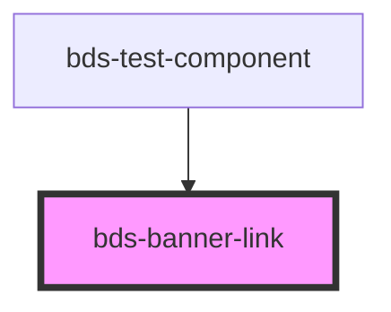

# banner-link

<!-- Auto Generated Below -->

## Properties

| Property | Attribute | Description        | Type     | Default     |
| -------- | --------- | ------------------ | -------- | ----------- |
| `link`   | `link`    | Set the link pass. | `string` | `undefined` |

## Events

| Event           | Description                       | Type               |
| --------------- | --------------------------------- | ------------------ |
| `bdsBannerLink` | Emitted when the link is clicked. | `CustomEvent<any>` |

## Dependencies

### Used by

 - [bds-test-component](../../test-component)

### Graph

----------------------------------------------

*Built with [StencilJS](https://stenciljs.com/)*
