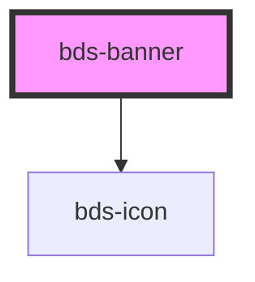

# bds-banner

<!-- Auto Generated Below -->

## Properties

| Property      | Attribute      | Description                                                             | Type                            | Default    |
| ------------- | -------------- | ----------------------------------------------------------------------- | ------------------------------- | ---------- |
| `bannerAlign` | `banner-align` | Set the banner aligment, it can be one of: 'center', 'right' or 'left'. | `"center" \| "left" \| "right"` | `'center'` |
| `variant`     | `variant`      | Set the banner varient, it can be 'system' or 'warning'.                | `"system" \| "warning"`         | `'system'` |

## Events

| Event            | Description                        | Type               |
| ---------------- | ---------------------------------- | ------------------ |
| `bdsBannerClose` | Emitted when the banner is closed. | `CustomEvent<any>` |

## Methods

### `toggle() => Promise<void>`

Pulbic method to close the banner

#### Returns

Type: `Promise<void>`

## Dependencies

### Depends on

- [bds-icon](../icon)

### Graph

----------------------------------------------

*Built with [StencilJS](https://stenciljs.com/)*
