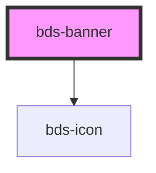

# bds-banner

<!-- Auto Generated Below -->

## Properties

| Property     | Attribute    | Description                                                                                 | Type      | Default     |
| ------------ | ------------ | ------------------------------------------------------------------------------------------- | --------- | ----------- |
| `background` | `background` | Specifies the background color to use. The default background color is $color-primary-main. | `string`  | `undefined` |
| `fixed`      | `fixed`      |                                                                                             | `boolean` | `false`     |

## Methods

### `toggle() => Promise<void>`

#### Returns

Type: `Promise<void>`

## Dependencies

### Depends on

- [bds-icon](../icon)

### Graph

----------------------------------------------

*Built with [StencilJS](https://stenciljs.com/)*
