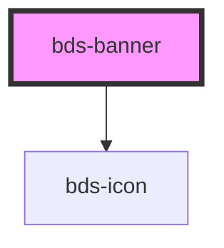

# bds-banner

<!-- Auto Generated Below -->

## Properties

| Property      | Attribute      | Description | Type                            | Default |
| ------------- | -------------- | ----------- | ------------------------------- | ------- |
| `bannerAlign` | `banner-align` |             | `"center" \| "left" \| "right"` | `null`  |
| `fixed`       | `fixed`        |             | `boolean`                       | `false` |
| `icon`        | `icon`         |             | `string`                        | `null`  |
| `variant`     | `variant`      |             | `"system" \| "warning"`         | `null`  |

## Events

| Event            | Description                        | Type               |
| ---------------- | ---------------------------------- | ------------------ |
| `bdsBannerClose` | Emitted when the banner is closed. | `CustomEvent<any>` |

## Methods

### `toggle() => Promise<void>`

Pulbic method to close the banner

#### Returns

Type: `Promise<void>`

## Dependencies

### Depends on

- [bds-icon](../icon)

### Graph

----------------------------------------------

*Built with [StencilJS](https://stenciljs.com/)*
