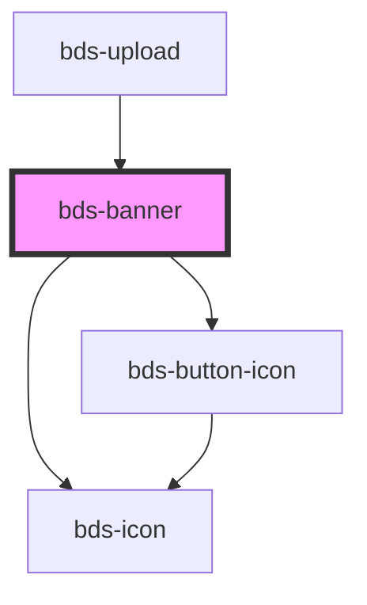

# bds-banner

<!-- Auto Generated Below -->

## Properties

| Property        | Attribute         | Description                                                                                                             | Type                                         | Default     |
| --------------- | ----------------- | ----------------------------------------------------------------------------------------------------------------------- | -------------------------------------------- | ----------- |
| `bannerAlign`   | `banner-align`    | Set the banner aligment, it can be one of: 'center', 'right' or 'left'.                                                 | `"center" \| "left" \| "right"`              | `'center'`  |
| `buttonClose`   | `button-close`    | Set if show up the close button.                                                                                        | `"false" \| "true"`                          | `'false'`   |
| `context`       | `context`         | Set if the banner is external or internal.                                                                              | `"inside" \| "outside"`                      | `'outside'` |
| `dtButtonClose` | `dt-button-close` | Data test is the prop to specifically test the component action object. dtButtonClose is the data-test to button close. | `string`                                     | `null`      |
| `variant`       | `variant`         | Set the banner varient, it can be 'system' or 'warning'.                                                                | `"error" \| "info" \| "system" \| "warning"` | `'system'`  |

## Events

| Event            | Description                        | Type               |
| ---------------- | ---------------------------------- | ------------------ |
| `bdsBannerClose` | Emitted when the banner is closed. | `CustomEvent<any>` |

## Methods

### `toggle() => Promise<void>`

#### Returns

Type: `Promise<void>`

## Dependencies

### Used by

 - [bds-upload](../upload)

### Depends on

- [bds-icon](../icon)
- [bds-button-icon](../icon-button)

### Graph

----------------------------------------------

*Built with [StencilJS](https://stenciljs.com/)*
