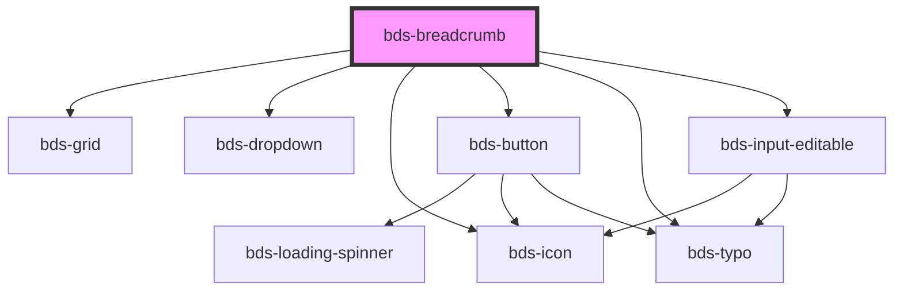

# bds-breadcrumb

<!-- Auto Generated Below -->

## Properties

| Property              | Attribute               | Description                                                       | Type                                            | Default |
| --------------------- | ----------------------- | ----------------------------------------------------------------- | ----------------------------------------------- | ------- |
| `editableCurrentPage` | `editable-current-page` | Enable editing of the current page label using bds-input-editable | `boolean`                                       | `false` |
| `items`               | `items`                 |                                                                   | `string \| { label: string; href?: string; }[]` | `[]`    |

## Events

| Event                       | Description                                    | Type                                                  |
| --------------------------- | ---------------------------------------------- | ----------------------------------------------------- |
| `bdsCurrentPageLabelChange` | Emitted when the current page label is changed | `CustomEvent<BreadcrumbCurrentPageChangeEventDetail>` |

## Dependencies

### Depends on

- [bds-grid](../grid)
- [bds-dropdown](../dropdown)
- [bds-icon](../icon)
- [bds-button](../button)
- [bds-typo](../typo)
- [bds-input-editable](../input-editable)

### Graph

----------------------------------------------

*Built with [StencilJS](https://stenciljs.com/)*
