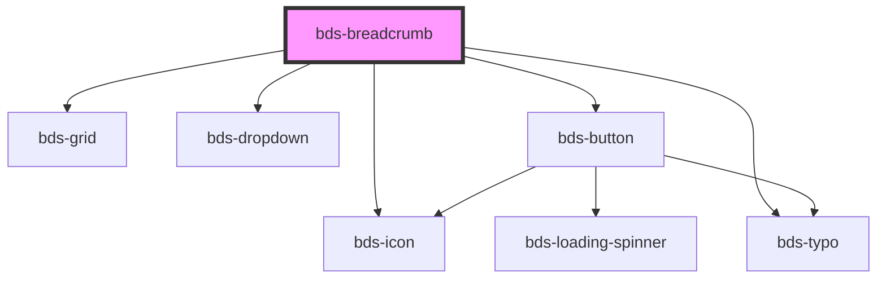

# bds-breadcrumb

<!-- Auto Generated Below -->

## Properties

| Property | Attribute | Description | Type                                            | Default |
| -------- | --------- | ----------- | ----------------------------------------------- | ------- |
| `items`  | `items`   |             | `string \| { label: string; href?: string; }[]` | `[]`    |

## Dependencies

### Depends on

- [bds-grid](../grid)
- [bds-dropdown](../dropdown)
- [bds-icon](../icon)
- [bds-button](../button)
- [bds-typo](../typo)

### Graph

----------------------------------------------

*Built with [StencilJS](https://stenciljs.com/)*
