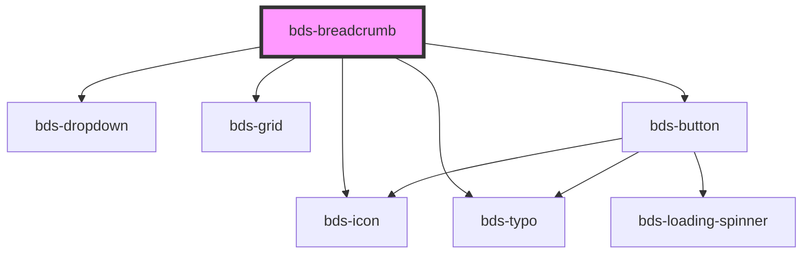

# bds-breadcrumb

<!-- Auto Generated Below -->

## Properties

| Property    | Attribute    | Description | Type                                            | Default |
| ----------- | ------------ | ----------- | ----------------------------------------------- | ------- |
| `items`     | `items`      |             | `string \| { label: string; href?: string; }[]` | `[]`    |
| `wrapItems` | `wrap-items` |             | `boolean`                                       | `true`  |

## Dependencies

### Depends on

- [bds-dropdown](../dropdown)
- [bds-grid](../grid)
- [bds-icon](../icon)
- [bds-typo](../typo)
- [bds-button](../button)

### Graph

```mermaid
graph TD;
  bds-breadcrumb --> bds-dropdown
  bds-breadcrumb --> bds-grid
  bds-breadcrumb --> bds-icon
  bds-breadcrumb --> bds-typo
  bds-breadcrumb --> bds-button
  bds-button --> bds-loading-spinner
  bds-button --> bds-icon
  bds-button --> bds-typo
  style bds-breadcrumb fill:#f9f,stroke:#333,stroke-width:4px
```

----------------------------------------------

*Built with [StencilJS](https://stenciljs.com/)*
