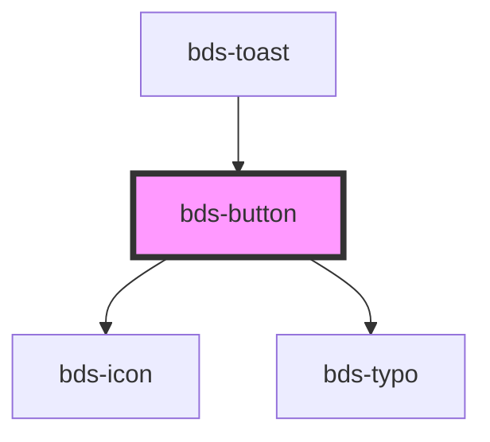

# sbp-button

<!-- Auto Generated Below -->

## Properties

| Property   | Attribute  | Description                                                                                        | Type                                              | Default      |
| ---------- | ---------- | -------------------------------------------------------------------------------------------------- | ------------------------------------------------- | ------------ |
| `arrow`    | `arrow`    | The arrow button                                                                                   | `boolean`                                         | `false`      |
| `bold`     | `bold`     | If true, the text will be bold                                                                     | `boolean`                                         | `false`      |
| `disabled` | `disabled` | If true, the base button will be disabled.                                                         | `boolean`                                         | `false`      |
| `icon`     | `icon`     | used for add icon in input left. Uses the bds-icon component.                                      | `string`                                          | `null`       |
| `size`     | `size`     | Size. Entered as one of the size. Can be one of:  'tall', 'standard', 'short';                     | `"short" \| "standard" \| "tall"`                 | `'standard'` |
| `type`     | `type`     | The type of the button. Can be one of:  'button', 'submit', 'reset';                               | `"button" \| "reset" \| "submit"`                 | `'button'`   |
| `variant`  | `variant`  | Variant. Entered as one of the variant. Can be one of:  'primary', 'secondary', 'ghost', 'dashed'; | `"dashed" \| "ghost" \| "primary" \| "secondary"` | `'primary'`  |

## Dependencies

### Used by

 - [bds-toast](../toast)

### Depends on

- [bds-icon](../icon)
- [bds-typo](../typo)

### Graph

----------------------------------------------

*Built with [StencilJS](https://stenciljs.com/)*
