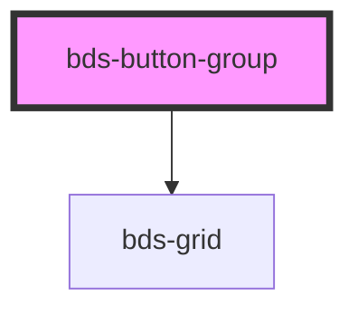

# bds-button

<!-- Auto Generated Below -->

## Properties

| Property    | Attribute   | Description                                                           | Type                                                     | Default     |
| ----------- | ----------- | --------------------------------------------------------------------- | -------------------------------------------------------- | ----------- |
| `color`     | `color`     | Color scheme for the buttons. Default is 'primary'.                   | `string`                                                 | `'primary'` |
| `direction` | `direction` | Direction of the button group layout. Can be one of: 'row', 'column'. | `"column" \| "column-reverse" \| "row" \| "row-reverse"` | `'row'`     |
| `multiple`  | `multiple`  | Allows multiple buttons to be selected simultaneously if true.        | `boolean`                                                | `false`     |
| `size`      | `size`      | Size of the buttons. Can be one of: 'medium', 'large'.                | `"large" \| "medium" \| "short" \| "standard" \| "tall"` | `'medium'`  |

## Events

| Event            | Description | Type               |
| ---------------- | ----------- | ------------------ |
| `buttonSelected` |             | `CustomEvent<any>` |

## Methods

### `activateButton(index: number) => Promise<void>`

#### Parameters

| Name    | Type     | Description |
| ------- | -------- | ----------- |
| `index` | `number` |             |

#### Returns

Type: `Promise<void>`

## Dependencies

### Depends on

- [bds-grid](../grid)

### Graph

----------------------------------------------

*Built with [StencilJS](https://stenciljs.com/)*
