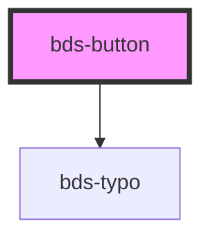

# sbp-button

<!-- Auto Generated Below -->

## Properties

| Property   | Attribute  | Description                                                                                     | Type                                           | Default      |
| ---------- | ---------- | ----------------------------------------------------------------------------------------------- | ---------------------------------------------- | ------------ |
| `disabled` | `disabled` | If true, the base button will be disabled.                                                      | `boolean`                                      | `false`      |
| `size`     | `size`     | Size. Entered as one of the size. Can be one of:  'tall', 'standard', 'short';                  | `"short" \| "standard" \| "tall"`              | `'standard'` |
| `variant`  | `variant`  | Variant. Entered as one of the variant. Can be one of:  'primary', 'second', 'ghost', 'dashed'; | `"dashed" \| "ghost" \| "primary" \| "second"` | `'primary'`  |

## Dependencies

### Depends on

- [bds-typo](../typo)

### Graph

----------------------------------------------

*Built with [StencilJS](https://stenciljs.com/)*
