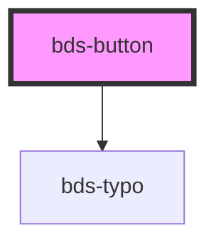

# sbp-button

<!-- Auto Generated Below -->

## Properties

| Property   | Attribute  | Description | Type                                           | Default      |
| ---------- | ---------- | ----------- | ---------------------------------------------- | ------------ |
| `disabled` | `disabled` |             | `boolean`                                      | `false`      |
| `size`     | `size`     |             | `"short" \| "standard" \| "tall"`              | `'standard'` |
| `variant`  | `variant`  |             | `"dashed" \| "ghost" \| "primary" \| "second"` | `'primary'`  |

## Dependencies

### Depends on

- [bds-typo](../typo)

### Graph

----------------------------------------------

*Built with [StencilJS](https://stenciljs.com/)*
