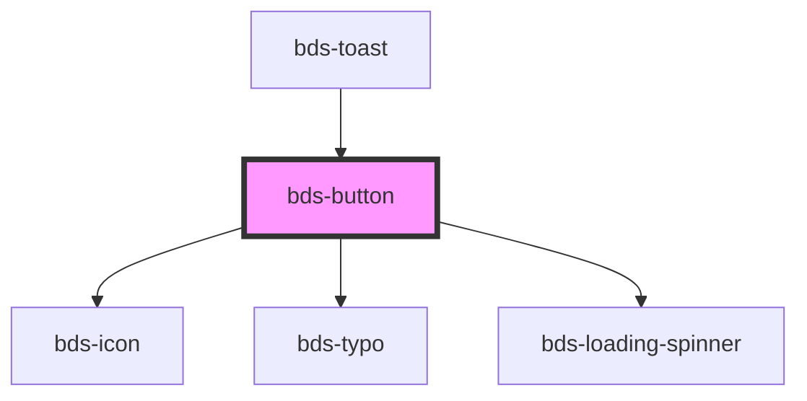

# bds-button

<!-- Auto Generated Below -->

## Properties

| Property            | Attribute             | Description                                                                                       | Type                                                                                  | Default      |
| ------------------- | --------------------- | ------------------------------------------------------------------------------------------------- | ------------------------------------------------------------------------------------- | ------------ |
| `arrow`             | `arrow`               | The arrow button                                                                                  | `boolean`                                                                             | `false`      |
| `bdsLoading`        | `bds-loading`         | If true, shows the loading spinner                                                                | `boolean`                                                                             | `false`      |
| `bdsLoadingVariant` | `bds-loading-variant` | If not empty, Sets the color of the spinner, can be 'primary','secondary' or 'ghost'              | `"ghost" \| "primary" \| "secondary"`                                                 | `'primary'`  |
| `disabled`          | `disabled`            | If true, the base button will be disabled.                                                        | `boolean`                                                                             | `false`      |
| `icon`              | `icon`                | used for add icon in input left. Uses the bds-icon component.                                     | `string`                                                                              | `null`       |
| `size`              | `size`                | Size. Entered as one of the size. Can be one of: 'tall', 'standard', 'short';                     | `"short" \| "standard" \| "tall"`                                                     | `'standard'` |
| `type`              | `type`                | The type of the button. Can be one of: 'button', 'submit', 'reset';                               | `"button" \| "reset" \| "submit"`                                                     | `'button'`   |
| `variant`           | `variant`             | Variant. Entered as one of the variant. Can be one of: 'primary', 'secondary', 'ghost', 'dashed'; | `"dashed" \| "facebook" \| "ghost" \| "primary" \| "secondary" \| "secondary--white"` | `'primary'`  |

## Dependencies

### Used by

 - [bds-toast](../toast)

### Depends on

- [bds-icon](../icon)
- [bds-typo](../typo)
- [bds-loading-spinner](../loading-spinner)

### Graph

----------------------------------------------

*Built with [StencilJS](https://stenciljs.com/)*
