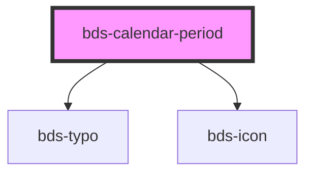

# bds-calendar

<!-- Auto Generated Below -->

## Properties

| Property              | Attribute               | Description                                                | Type      | Default |
| --------------------- | ----------------------- | ---------------------------------------------------------- | --------- | ------- |
| `dateLimit`           | `date-limit`            | DateLimit. Insert a limiter to select the date period.     | `number`  | `null`  |
| `selectBeforeCurrent` | `select-before-current` | SelectBeforeCurrent. Disable selection before current day. | `boolean` | `false` |

## Events

| Event          | Description | Type               |
| -------------- | ----------- | ------------------ |
| `bdsEndDate`   |             | `CustomEvent<any>` |
| `bdsStartDate` |             | `CustomEvent<any>` |

## Dependencies

### Depends on

- [bds-typo](../../typo)
- [bds-icon](../../icon)

### Graph

----------------------------------------------

*Built with [StencilJS](https://stenciljs.com/)*
