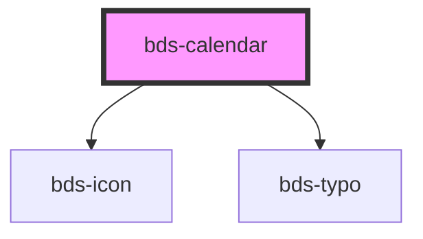

# bds-calendar

<!-- Auto Generated Below -->

## Properties

| Property       | Attribute | Description            | Type   | Default |
| -------------- | --------- | ---------------------- | ------ | ------- |
| `dateSelected` | --        | Date, Inserted a date. | `Date` | `null`  |

## Dependencies

### Depends on

- [bds-icon](../icon)
- [bds-typo](../typo)

### Graph

----------------------------------------------

*Built with [StencilJS](https://stenciljs.com/)*
