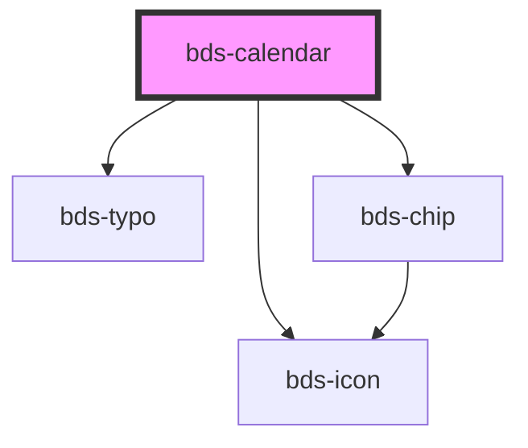

# bds-calendar

<!-- Auto Generated Below -->

## Properties

| Property       | Attribute     | Description                                                            | Type     | Default |
| -------------- | ------------- | ---------------------------------------------------------------------- | -------- | ------- |
| `dateSelected` | --            | DateSelected, Inserted a date to input selection.                      | `Date`   | `null`  |
| `messageBox`   | `message-box` | MessageBox, Used to insert an informational message into the calendar. | `string` | `''`    |

## Dependencies

### Depends on

- [bds-icon](../icon)
- [bds-typo](../typo)
- [bds-chip](../chip)

### Graph

----------------------------------------------

*Built with [StencilJS](https://stenciljs.com/)*
