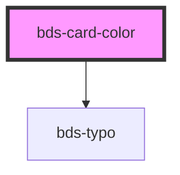

# bds-card-color

<!-- Auto Generated Below -->

## Properties

| Property                | Attribute  | Description                                      | Type     | Default     |
| ----------------------- | ---------- | ------------------------------------------------ | -------- | ----------- |
| `hex`                   | `hex`      | Specifies HEX color, use Figma docs in Blip DS.  | `string` | `undefined` |
| `name` _(required)_     | `name`     | Specifies name color, use Figma docs in Blip DS. | `string` | `undefined` |
| `variable` _(required)_ | `variable` | Specifies variabel sass color, _variables.scss.  | `string` | `undefined` |

## Dependencies

### Depends on

- [bds-typo](../typo)

### Graph

----------------------------------------------

*Built with [StencilJS](https://stenciljs.com/)*
