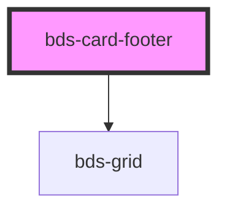

# bds-card-footer

<!-- Auto Generated Below -->

## Properties

| Property | Attribute | Description                                                               | Type                                                                                            | Default      |
| -------- | --------- | ------------------------------------------------------------------------- | ----------------------------------------------------------------------------------------------- | ------------ |
| `align`  | `align`   | Prop for internal elements alignment. Will follow the same values of css. | `"center" \| "flex-end" \| "flex-start" \| "space-around" \| "space-between" \| "space-evenly"` | `'flex-end'` |

## Dependencies

### Depends on

- [bds-grid](../../grid)

### Graph

----------------------------------------------

*Built with [StencilJS](https://stenciljs.com/)*
