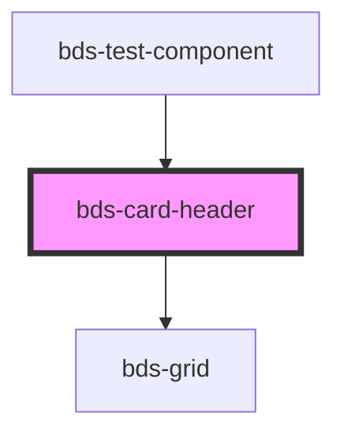

# bds-card-header

<!-- Auto Generated Below -->

## Properties

| Property | Attribute | Description                                                                                    | Type                                                                                            | Default           |
| -------- | --------- | ---------------------------------------------------------------------------------------------- | ----------------------------------------------------------------------------------------------- | ----------------- |
| `align`  | `align`   | Variant. Entered as one of the variant. Can be one of: 'system', 'error', 'warning', 'delete'; | `"center" \| "flex-end" \| "flex-start" \| "space-around" \| "space-between" \| "space-evenly"` | `'space-between'` |

## Dependencies

### Used by

 - [bds-test-component](../../test-component)

### Depends on

- [bds-grid](../../grid)

### Graph

----------------------------------------------

*Built with [StencilJS](https://stenciljs.com/)*
