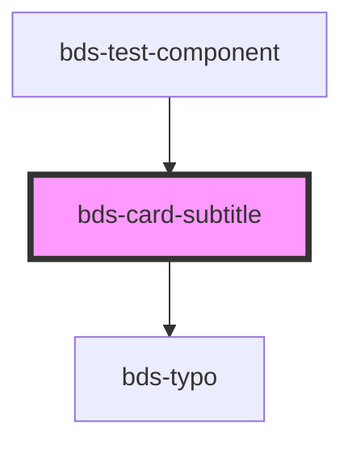

# bds-card-subtitle

<!-- Auto Generated Below -->

## Properties

| Property | Attribute | Description         | Type     | Default     |
| -------- | --------- | ------------------- | -------- | ----------- |
| `text`   | `text`    | Set the card title. | `string` | `undefined` |

## Dependencies

### Used by

 - [bds-test-component](../../test-component)

### Depends on

- [bds-typo](../../typo)

### Graph

----------------------------------------------

*Built with [StencilJS](https://stenciljs.com/)*
