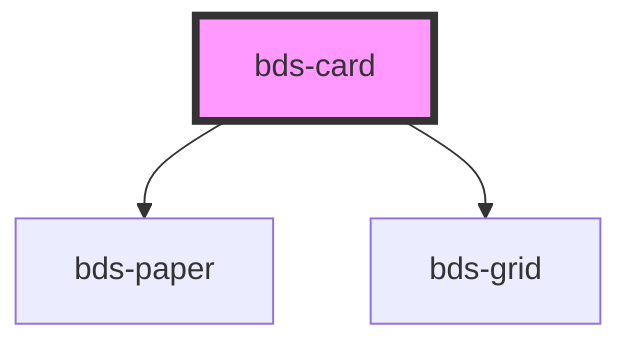

# bds-card

<!-- Auto Generated Below -->

## Properties

| Property      | Attribute      | Description                                                             | Type                                                                                                                                | Default         |
| ------------- | -------------- | ----------------------------------------------------------------------- | ----------------------------------------------------------------------------------------------------------------------------------- | --------------- |
| `bgColor`     | `bg-color`     | Prop for set the background color.                                      | `"surface-0" \| "surface-1" \| "surface-2" \| "surface-3" \| "surface-4"`                                                           | `'surface-1'`   |
| `borderColor` | `border-color` | Prop for set the border color.                                          | `"border-1" \| "border-2" \| "delete" \| "error" \| "negative" \| "positive" \| "primary" \| "secondary" \| "success" \| "warning"` | `null`          |
| `clickable`   | `clickable`    | If the prop is true, the component will be clickable.                   | `boolean`                                                                                                                           | `false`         |
| `dataTest`    | `data-test`    | Data test is the prop to specifically test the component action object. | `string`                                                                                                                            | `null`          |
| `height`      | `height`       | Prop for set the height of the component.                               | `string`                                                                                                                            | `null`          |
| `selectable`  | `selectable`   | Prop for set the background color.                                      | `boolean`                                                                                                                           | `false`         |
| `width`       | `width`        | Prop for set the width of the component.                                | `string`                                                                                                                            | `'fit-content'` |

## Events

| Event      | Description                                              | Type               |
| ---------- | -------------------------------------------------------- | ------------------ |
| `bdsClick` | This event will be dispatch when click on the component. | `CustomEvent<any>` |

## Dependencies

### Depends on

- [bds-paper](../paper)
- [bds-grid](../grid)

### Graph

----------------------------------------------

*Built with [StencilJS](https://stenciljs.com/)*
