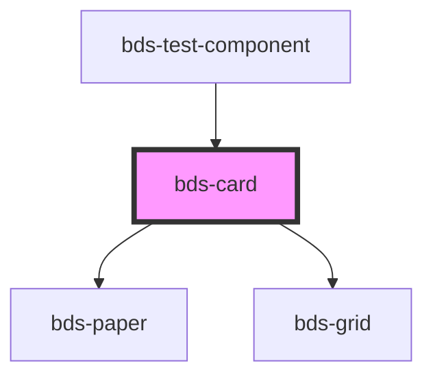

# bds-card

<!-- Auto Generated Below -->

## Properties

| Property    | Attribute   | Description                               | Type      | Default         |
| ----------- | ----------- | ----------------------------------------- | --------- | --------------- |
| `clickable` | `clickable` | Prop for set the width of the component.  | `boolean` | `false`         |
| `height`    | `height`    | Prop for set the height of the component. | `string`  | `null`          |
| `width`     | `width`     | Prop for set the width of the component.  | `string`  | `'fit-content'` |

## Dependencies

### Used by

 - [bds-test-component](../test-component)

### Depends on

- [bds-paper](../paper)
- [bds-grid](../grid)

### Graph

----------------------------------------------

*Built with [StencilJS](https://stenciljs.com/)*
