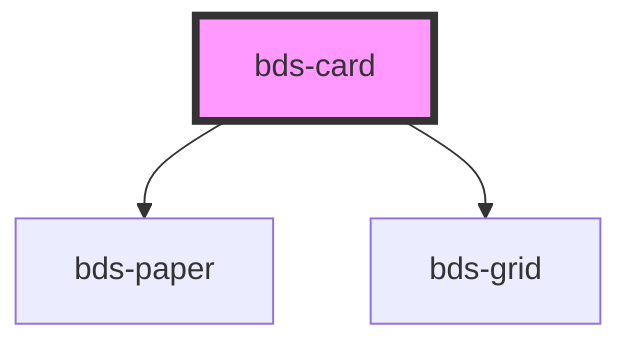

# bds-card

<!-- Auto Generated Below -->

## Properties

| Property    | Attribute   | Description                                           | Type      | Default         |
| ----------- | ----------- | ----------------------------------------------------- | --------- | --------------- |
| `clickable` | `clickable` | If the prop is true, the component will be clickable. | `boolean` | `false`         |
| `height`    | `height`    | Prop for set the height of the component.             | `string`  | `null`          |
| `width`     | `width`     | Prop for set the width of the component.              | `string`  | `'fit-content'` |

## Events

| Event      | Description                                              | Type               |
| ---------- | -------------------------------------------------------- | ------------------ |
| `bdsClick` | This event will be dispatch when click on the component. | `CustomEvent<any>` |

## Dependencies

### Depends on

- [bds-paper](../paper)
- [bds-grid](../grid)

### Graph

----------------------------------------------

*Built with [StencilJS](https://stenciljs.com/)*
