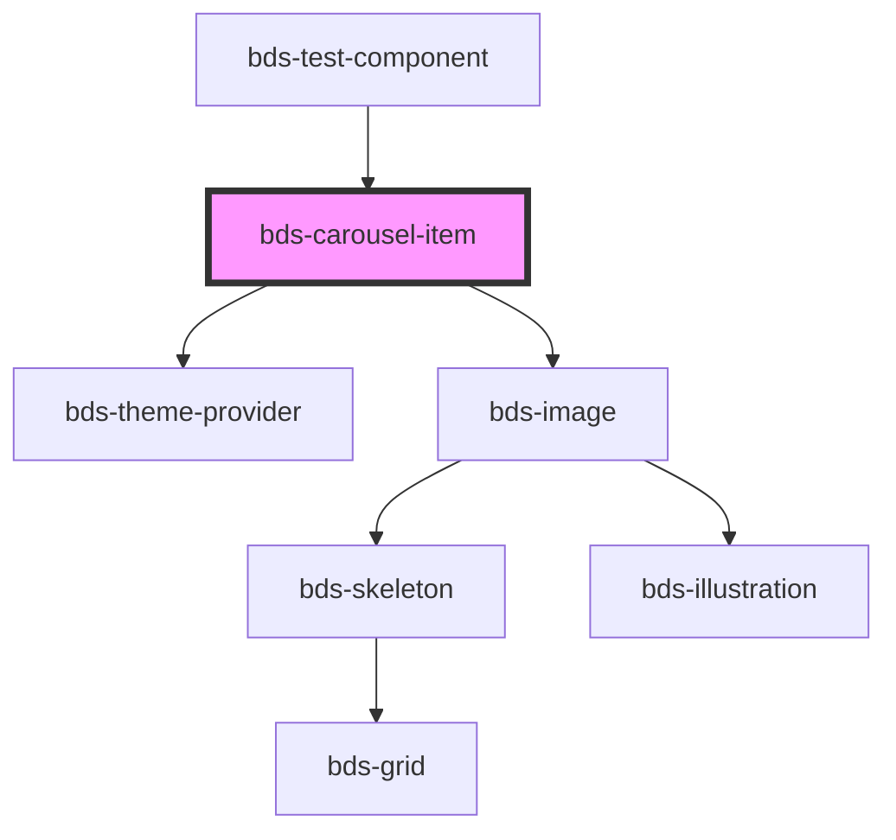

# bds-carousel-item

<!-- Auto Generated Below -->

## Properties

| Property            | Attribute             | Description                                                          | Type                                   | Default     |
| ------------------- | --------------------- | -------------------------------------------------------------------- | -------------------------------------- | ----------- |
| `bgColor`           | `bg-color`            |                                                                      | `string`                               | `undefined` |
| `bgImage`           | `bg-image`            |                                                                      | `string`                               | `undefined` |
| `bgImageBrightness` | `bg-image-brightness` |                                                                      | `number`                               | `1`         |
| `theme`             | `theme`               | Set what theme will be aplyed inside the component. 'light', 'dark'; | `"dark" \| "high-contrast" \| "light"` | `'light'`   |

## Dependencies

### Used by

 - [bds-test-component](../test-component)

### Depends on

- [bds-theme-provider](../theme-provider)
- [bds-image](../image)

### Graph

----------------------------------------------

*Built with [StencilJS](https://stenciljs.com/)*
