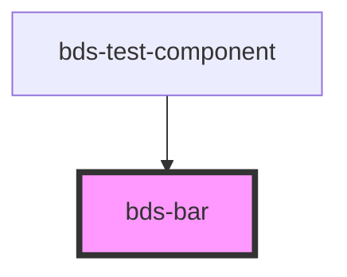

# bds-bar

<!-- Auto Generated Below -->

## Overview

Bar Component - Configuration for bar in chart

Must be used as a child of bds-chart-bar

## Properties

| Property  | Attribute  | Description                                                                                                                                 | Type     | Default     |
| --------- | ---------- | ------------------------------------------------------------------------------------------------------------------------------------------- | -------- | ----------- |
| `color`   | `color`    | Color of the bar (hex, rgb, or CSS variable)                                                                                                | `string` | `'#0d6efd'` |
| `dataKey` | `data-key` | Key from data object to use for bar values                                                                                                  | `string` | `undefined` |
| `radius`  | `radius`   | Border radius of bar corners (in pixels)                                                                                                    | `number` | `4`         |
| `stackId` | `stack-id` | Stack identifier. Bars with the same stackId are stacked on top of each other. Bars with different (or no) stackId are placed side-by-side. | `string` | `undefined` |

## Dependencies

### Used by

 - [bds-test-component](../../test-component)

### Graph

----------------------------------------------

*Built with [StencilJS](https://stenciljs.com/)*
