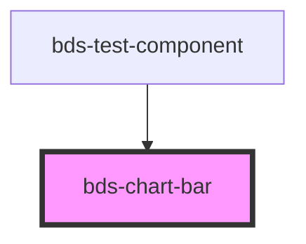

# bds-chart-bar

<!-- Auto Generated Below -->

## Properties

| Property    | Attribute    | Description | Type                            | Default                                  |
| ----------- | ------------ | ----------- | ------------------------------- | ---------------------------------------- |
| `align`     | `align`      |             | `"center" \| "left" \| "right"` | `'left'`                                 |
| `barRadius` | `bar-radius` |             | `number`                        | `6`                                      |
| `color`     | `color`      |             | `string`                        | `'var(--color-extended-green, #05b96c)'` |
| `data`      | `data`       |             | `ChartDatum[] \| string`        | `[]`                                     |
| `vertical`  | `vertical`   |             | `boolean`                       | `false`                                  |

## CSS Custom Properties

| Name                            | Description                                  |
| ------------------------------- | -------------------------------------------- |
| `--chart-hover-highlight-color` | Background color of the bar hover highlight. |

## Dependencies

### Used by

 - [bds-test-component](../../test-component)

### Graph

----------------------------------------------

*Built with [StencilJS](https://stenciljs.com/)*
