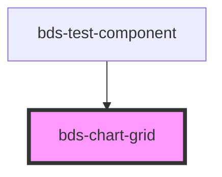

# bds-chart-grid

<!-- Auto Generated Below -->

## Overview

CartesianGrid - Simple grid line renderer

Props:
- vertical: boolean - Show vertical grid lines
- horizontal: boolean - Show horizontal grid lines
- strokeStyle: 'solid' | 'dashed' - Line style

Usage: Pass gridLines data via context or parent coordination

## Properties

| Property      | Attribute      | Description                         | Type                  | Default   |
| ------------- | -------------- | ----------------------------------- | --------------------- | --------- |
| `horizontal`  | `horizontal`   | Show horizontal grid lines (Y-axis) | `boolean \| string`   | `true`    |
| `strokeStyle` | `stroke-style` | Grid line style: solid or dashed    | `"dashed" \| "solid"` | `'solid'` |
| `vertical`    | `vertical`     | Show vertical grid lines (X-axis)   | `boolean \| string`   | `false`   |

## Dependencies

### Used by

 - [bds-test-component](../../test-component)

### Graph

----------------------------------------------

*Built with [StencilJS](https://stenciljs.com/)*
