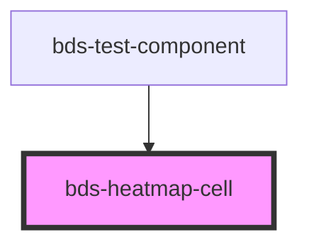

# bds-heatmap-cell

<!-- Auto Generated Below -->

## Overview

HeatmapCell — Configuration slot for bds-chart-heatmap.

Place as a child of <bds-chart-heatmap> to override cell appearance.
Renders as display:none — parent reads props via getAttribute().

## Properties

| Property   | Attribute   | Description                                                                    | Type     | Default     |
| ---------- | ----------- | ------------------------------------------------------------------------------ | -------- | ----------- |
| `color`    | `color`     | Base fill color of the cells. Overrides bds-chart-heatmap color prop.          | `string` | `undefined` |
| `radius`   | `radius`    | Border-radius of cells in pixels. Overrides bds-chart-heatmap cellRadius prop. | `number` | `undefined` |
| `valueKey` | `value-key` | Data field key for intensity value. Overrides bds-chart-heatmap valueKey prop. | `string` | `undefined` |

## Dependencies

### Used by

 - [bds-test-component](../../test-component)

### Graph

----------------------------------------------

*Built with [StencilJS](https://stenciljs.com/)*
