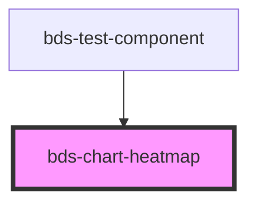

# bds-chart-heatmap

<!-- Auto Generated Below -->

## Overview

ChartHeatmap — Grid/matrix heatmap chart.

Renders two-dimensional categorical data as a grid of colored cells.
Cell intensity is determined by a numeric value field mapped to opacity (0.1–1.0).

Slot children (all optional):
  - <bds-heatmap-cell>  override cell color, radius, valueKey
  - <bds-x-axis>        configure bottom axis labels
  - <bds-y-axis>        configure left axis labels
  - <bds-chart-grid>    show grid lines
  - <bds-chart-tooltip> enable hover tooltip

## Properties

| Property      | Attribute      | Description                                                                                  | Type                     | Default                                 |
| ------------- | -------------- | -------------------------------------------------------------------------------------------- | ------------------------ | --------------------------------------- |
| `cellPadding` | `cell-padding` | Gap between cells in pixels.                                                                 | `number`                 | `2`                                     |
| `cellRadius`  | `cell-radius`  | Border-radius of each cell in pixels.                                                        | `number`                 | `4`                                     |
| `color`       | `color`        | Base fill color of cells. Can be overridden by <bds-heatmap-cell color="...">.               | `string`                 | `'var(--color-extended-blue, #0d6efd)'` |
| `data`        | `data`         | Array of data objects or JSON string. Each object must have xKey, yKey, and valueKey fields. | `ChartDatum[] \| string` | `[]`                                    |
| `valueKey`    | `value-key`    | Data field whose numeric value drives cell opacity (min → 0.1, max → 1.0).                   | `string`                 | `'value'`                               |
| `xKey`        | `x-key`        | Data field used for X-axis (column) categories.                                              | `string`                 | `'x'`                                   |
| `yKey`        | `y-key`        | Data field used for Y-axis (row) categories.                                                 | `string`                 | `'y'`                                   |

## Dependencies

### Used by

 - [bds-test-component](../../test-component)

### Graph

----------------------------------------------

*Built with [StencilJS](https://stenciljs.com/)*
