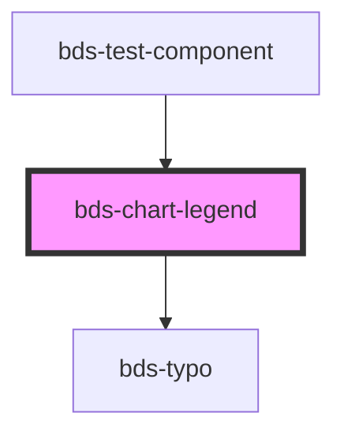

# bds-chart-legend

<!-- Auto Generated Below -->

## Overview

ChartLegend — Renders the interactive legend for chart components.

Must be used as a child of bds-chart-line or bds-chart-bar.
The parent chart pushes data via setLegendState() and listens to bdsLegendItemClick.

Modes:
 - Series mode (no dataKey): reads bds-line/bds-bar siblings for color + label.
 - Category mode (dataKey set): reads unique values of dataKey from data,
   assigns palette colors to each category, and recolors bars/dots accordingly.

## Properties

| Property  | Attribute  | Description | Type                            | Default     |
| --------- | ---------- | ----------- | ------------------------------- | ----------- |
| `align`   | `align`    |             | `"center" \| "left" \| "right"` | `'center'`  |
| `dataKey` | `data-key` |             | `string`                        | `undefined` |

## Events

| Event                | Description | Type                  |
| -------------------- | ----------- | --------------------- |
| `bdsLegendItemClick` |             | `CustomEvent<string>` |

## Methods

### `setLegendState(state: LegendState) => Promise<void>`

#### Parameters

| Name    | Type          | Description |
| ------- | ------------- | ----------- |
| `state` | `LegendState` |             |

#### Returns

Type: `Promise<void>`

## Dependencies

### Used by

 - [bds-test-component](../../test-component)

### Depends on

- [bds-typo](../../typo)

### Graph

----------------------------------------------

*Built with [StencilJS](https://stenciljs.com/)*
