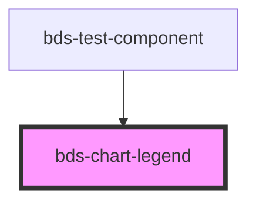

# bds-chart-legend

<!-- Auto Generated Below -->

## Overview

ChartLegend — Configuration component for chart legends.

Must be used as a child of bds-chart-line or bds-chart-bar.

Modes:
 - Series mode (no dataKey): reads bds-line/bds-bar siblings for color + label.
 - Category mode (dataKey set): reads unique values of dataKey from data,
   assigns palette colors to each category, and recolors bars/dots accordingly.

## Properties

| Property  | Attribute  | Description                                                                                                                                         | Type                            | Default     |
| --------- | ---------- | --------------------------------------------------------------------------------------------------------------------------------------------------- | ------------------------------- | ----------- |
| `align`   | `align`    | Horizontal alignment of legend items inside the chart.                                                                                              | `"center" \| "left" \| "right"` | `'center'`  |
| `dataKey` | `data-key` | Key from data objects to use as category labels (activates category mode). Example: dataKey="label" reads "Product A", "Product B", etc. from data. | `string`                        | `undefined` |

## Dependencies

### Used by

 - [bds-test-component](../../test-component)

### Graph

----------------------------------------------

*Built with [StencilJS](https://stenciljs.com/)*
