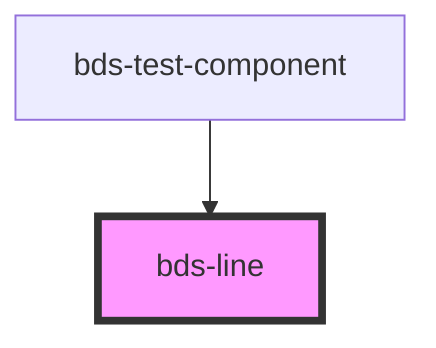

# bds-line

<!-- Auto Generated Below -->

## Overview

Line Component - Configuration for line in chart

Must be used as a child of bds-chart-line

## Properties

| Property      | Attribute      | Description                                        | Type                     | Default      |
| ------------- | -------------- | -------------------------------------------------- | ------------------------ | ------------ |
| `color`       | `color`        | Color of the line (hex, rgb, or CSS variable)      | `string`                 | `'#0d6efd'`  |
| `curve`       | `curve`        | Type of interpolation: linear or monotone (smooth) | `"linear" \| "monotone"` | `'monotone'` |
| `dataKey`     | `data-key`     | Key from data object to use for line values        | `string`                 | `undefined`  |
| `dot`         | `dot`          | Whether to show dots on data points                | `boolean`                | `true`       |
| `radius`      | `radius`       | Radius of data point circles (in pixels)           | `number`                 | `4`          |
| `strokeWidth` | `stroke-width` | Width of the line stroke (in pixels)               | `number`                 | `2`          |

## Dependencies

### Used by

 - [bds-test-component](../../test-component)

### Graph

----------------------------------------------

*Built with [StencilJS](https://stenciljs.com/)*
