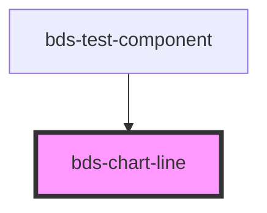

# bds-chart-line

<!-- Auto Generated Below -->

## Properties

| Property       | Attribute       | Description | Type                     | Default                                 |
| -------------- | --------------- | ----------- | ------------------------ | --------------------------------------- |
| `circleRadius` | `circle-radius` |             | `number`                 | `4`                                     |
| `color`        | `color`         |             | `string`                 | `'var(--color-extended-blue, #0d66f4)'` |
| `curve`        | `curve`         |             | `"linear" \| "monotone"` | `'monotone'`                            |
| `data`         | `data`          |             | `ChartDatum[] \| string` | `[]`                                    |
| `strokeWidth`  | `stroke-width`  |             | `number`                 | `2`                                     |

## Dependencies

### Used by

 - [bds-test-component](../../test-component)

### Graph

----------------------------------------------

*Built with [StencilJS](https://stenciljs.com/)*
