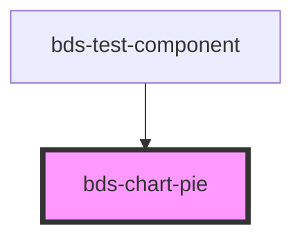

# bds-chart-pie

<!-- Auto Generated Below -->

## Overview

ChartPie — Donut/pie chart component.

Renders categorical data as a donut chart. Each datum becomes one slice.
Colors are assigned automatically from the design-system palette.

Slot children (all optional):
  - <bds-pie-config>      override innerRadius, padAngle, cornerRadius
  - <bds-chart-legend>    enable clickable legend
  - <bds-chart-tooltip>   enable hover tooltip

## Properties

| Property   | Attribute   | Description                                                                               | Type                     | Default                                 |
| ---------- | ----------- | ----------------------------------------------------------------------------------------- | ------------------------ | --------------------------------------- |
| `color`    | `color`     | Fallback color (palette is used automatically; this is a last-resort override).           | `string`                 | `'var(--color-extended-blue, #0d6efd)'` |
| `data`     | `data`      | Array of data objects or JSON string. Each object must have labelKey and valueKey fields. | `ChartDatum[] \| string` | `[]`                                    |
| `labelKey` | `label-key` | Field name used for slice labels.                                                         | `string`                 | `'label'`                               |
| `valueKey` | `value-key` | Field name whose numeric value determines each slice size.                                | `string`                 | `'value'`                               |

## CSS Custom Properties

| Name                           | Description                      |
| ------------------------------ | -------------------------------- |
| `--chart-pie-hover-brightness` | Filter applied to hovered slice. |

## Dependencies

### Used by

 - [bds-test-component](../../test-component)

### Graph

----------------------------------------------

*Built with [StencilJS](https://stenciljs.com/)*
