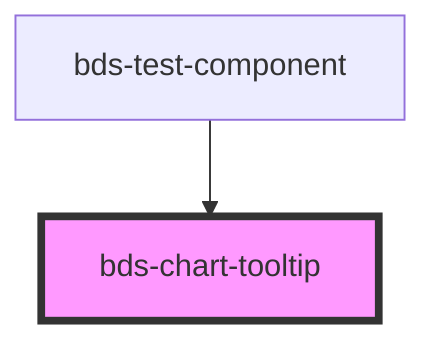

# bds-chart-tooltip

<!-- Auto Generated Below -->

## Properties

| Property        | Attribute        | Description | Type                          | Default     |
| --------------- | ---------------- | ----------- | ----------------------------- | ----------- |
| `hideIndicator` | `hide-indicator` |             | `boolean`                     | `false`     |
| `hideLabel`     | `hide-label`     |             | `boolean`                     | `false`     |
| `indicator`     | `indicator`      |             | `"dashed" \| "dot" \| "line"` | `'dot'`     |
| `labelKey`      | `label-key`      |             | `string`                      | `undefined` |
| `nameKey`       | `name-key`       |             | `string`                      | `undefined` |

## Methods

### `setTooltipState(state: { visible?: boolean; x?: number; y?: number; label?: string; content?: string; entries?: TooltipEntry[]; }) => Promise<void>`

#### Parameters

| Name    | Type                                                                                                         | Description |
| ------- | ------------------------------------------------------------------------------------------------------------ | ----------- |
| `state` | `{ visible?: boolean; x?: number; y?: number; label?: string; content?: string; entries?: TooltipEntry[]; }` |             |

#### Returns

Type: `Promise<void>`

## Dependencies

### Used by

 - [bds-test-component](../../test-component)

### Graph

----------------------------------------------

*Built with [StencilJS](https://stenciljs.com/)*
