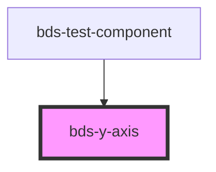

# bds-y-axis

<!-- Auto Generated Below -->

## Overview

YAxis Component - Configuration for Y-axis

Must be used as a child of bds-chart-line or bds-chart-bar

## Properties

| Property        | Attribute        | Description                                                                                                            | Type      | Default     |
| --------------- | ---------------- | ---------------------------------------------------------------------------------------------------------------------- | --------- | ----------- |
| `axisLine`      | `axis-line`      | Show axis line                                                                                                         | `boolean` | `true`      |
| `dataKey`       | `data-key`       | Key from data object to use for Y-axis scale                                                                           | `string`  | `'value'`   |
| `show`          | `show`           | Show Y-axis labels                                                                                                     | `boolean` | `true`      |
| `tickCount`     | `tick-count`     | Number of ticks to display on the Y-axis (default: 5) Increase to show more ticks (e.g., 10 for 20, 25, 30, 35, 40...) | `number`  | `5`         |
| `tickFormatter` | `tick-formatter` | Format function for tick labels (receives value, returns formatted string)                                             | `string`  | `undefined` |
| `tickLine`      | `tick-line`      | Show tick lines                                                                                                        | `boolean` | `true`      |
| `tickMargin`    | `tick-margin`    | Margin between tick and label (in pixels)                                                                              | `number`  | `10`        |

## Dependencies

### Used by

 - [bds-test-component](../../test-component)

### Graph

----------------------------------------------

*Built with [StencilJS](https://stenciljs.com/)*
